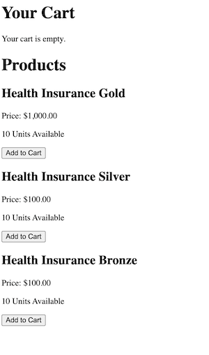

# Nayya QA Skills Interview

## Welcome Nayya Interviewer

Today you are running an interview with a potential QA engineer. Please make sure you have nayya-shopping-cart running locally and being served through serveo before joining the interview (Steps 1 and 2)

### Step 1: Running Locally

Run bundle install and the following database commands to make sure you are install a fresh instance (don't forget to turn off any existing servers you have running at port 3000)

`bundle install && rails db:drop && rails db:create && rails db:migrate && rails db:seed && rails server`

After running this command you should have 3 products, 2 users, and 0 line items to start. 

Think of a Line Item as a Line Item in a receipt. They each represent one item in your cart.

### Step 2: Serving Localhost through the Internet

Serveo is a free option to forward your localhost:3000 port to the internet. 

`ssh -R 80:localhost:3000 serveo.net`

Learn more at https://serveo.net/

The URL should looking something like `https://c930eef2afb0e16dd48db4690c7514a5.serveo.net/`

**Check that the URL is working. It should bring you into the sign in page.**

***

### Step 3: Setting up the Interview

Welcome the interviewee with some introductions. Once you are ready, share your Serveo URL (from your terminal) with the interviewee. 

Ask them to share their screen once they have reached the sign in page. Tell them that they can log in with `qa@nayya.com` and password `nayya123` to start.

Once they log in, introduce them to the shopping cart. There should be 3 types of insurances with a inventory of 10 each to start. 

### Step 4: Debugging the basics together

Tell the interviewee that this is a shopping cart application where you can add or remove insurance plans from your cart. 

Ask the interviewee to create a checklist of what features they would want to test before touching anything on the page. This plan should include steps like 
1. Not letting the user add more than 10 units 
2. The proper calcuation of a subtotal. 
3. The proper increment and decrement of quantities as they are added/removed from the cart

Note: the increment/decrement and the subtotal calcuations should be work. The 10 unit limit is broken (quantities can become negative).

Important topics to cover:
- [ ] Adding validations to ensure that quantities can not go below zero
- [ ] Ask them about how they would write automated tests to ensure behavior

Ask the interviewee to run the manual test plan and observe how quickly/naturally they navigate it. They should communicate what they're thinking about verbally - if not, please prompt them to.

### Step 5: Debugging the advanced together

Bonus points if the interviewee decides to add the multi-user aspects into the original test plan. If not, at this point you can let the user know that there is a `qa2@nayya.com` user with the same `nayya123` password.

Ask them to write a plan on items to check for in the multi-user experience. Some options include
1. Making sure the quantities increment/decrement when another user adds/removes to their cart (it does not).
2. Check if the cart expires and returns quantities back to the pool if they leave their session or log out (it does not).

More advanced items that are nice to haves:
- [ ] Log out by deleting the cookie (since there is no log out button)
- [ ] Checking the network tab for status codes. Right now the Remove item request returns a 406 status code even though the UI succeeds.
- [ ] Talk about how to implement a 2-way communication between browser and server (websockets, server side events, http polling). Bonus if they can discuss the pros and cons. 

### Step 6: Wrapping up
Ask the intervewee what their thoughts are on the exercise. This is a fairly untested version so any feedback is helpful. Ask them about how they think about testing and working with engineers. 

Leave time at the end for them to ask you questions (no more than 5 minutes).

